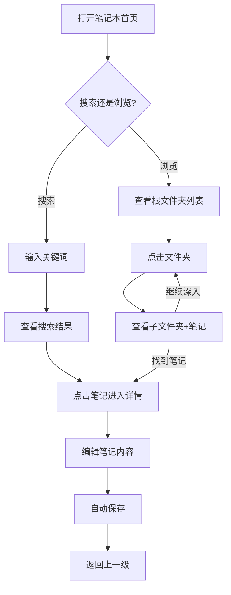

## 1. 产品概述

基于PC端笔记本模块（文件夹+笔记多级树形层级）的逻辑，重新设计移动端笔记界面，提供多套视觉方案供选择和评审。
- 目标用户：笔记本模块的移动端使用者
- 核心诉求：在手机小屏幕上清晰展示文件夹/笔记的层级关系，同时保持操作便捷和视觉美观

## 2. 核心功能

### 2.1 功能模块
1. **笔记本首页**：展示文件夹列表、置顶笔记、搜索入口
2. **文件夹浏览**：展示子文件夹和笔记列表，支持层级导航
3. **笔记详情**：标题+内容编辑，自动保存
4. **笔记管理**：新建、移动、置顶、收藏、删除

### 2.2 页面详情
| 页面名称 | 模块名称 | 功能描述 |
|---------|---------|---------|
| 笔记本首页 | 文件夹树 | 展示根级文件夹，点击进入子文件夹 |
| 笔记本首页 | 置顶笔记 | 展示所有置顶笔记（含路径信息） |
| 笔记本首页 | 搜索 | 全局搜索笔记和文件夹 |
| 文件夹视图 | 子文件夹列表 | 展示当前文件夹下的子文件夹 |
| 文件夹视图 | 笔记列表 | 展示当前文件夹下的笔记 |
| 文件夹视图 | 面包屑导航 | 显示当前路径，支持返回上级 |
| 笔记详情 | 编辑 | 富文本编辑器，自动保存 |

## 3. 核心流程

用户打开笔记本 → 看到根文件夹和置顶笔记 → 点击文件夹进入 → 看到子文件夹和笔记 → 点击笔记进入 → 查看/编辑笔记内容 → 返回继续浏览

## 4. 界面设计方案

### 4.1 设计风格
- 延续PC端的文件夹/笔记树形层级逻辑
- 移动端适配：单手操作、手势导航、触控友好
- 配色：以蓝色(#2563eb)为主色，橙色(#f97316)为文件夹色，黄色(#fbbf24)为置顶色

### 4.2 设计原则
- **层级可视化**：文件夹嵌套关系在移动端要清晰可见
- **操作效率**：减少点击次数，常用操作一步到位
- **信息密度**：平衡信息展示量和可读性
- **一致性**：与PC端数据结构保持一致

### 4.3 方案概览
| 方案名称 | 核心特点 | 适用场景 |
|---------|---------|---------|
| 方案A - 沉浸式树形导航 | 展开/收起的完整树视图，层级缩进清晰 | 文件夹层级深、笔记多的用户 |
| 方案B - 底部Tab分类导航 | 文件夹/笔记/标签分Tab展示，面包屑路径 | 文件夹数量适中，快速切换 |
| 方案C - 智能工作台模式 | 数据看板+最近笔记+快捷操作 | 高频使用，需要快速概览 |
| 方案D - 侧栏抽屉+内容流 | 左侧抽屉树导航，右侧内容瀑布流 | 需要全屏沉浸式阅读 |
