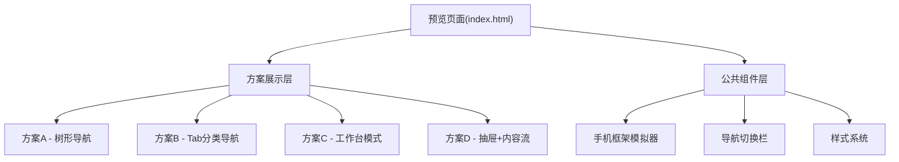

## 1. 架构设计



## 2. 技术说明

- 前端：纯 HTML + CSS + JavaScript (Vanilla JS)
- 预览工具：Vite dev server 或 静态文件服务
- 无后端依赖，所有数据为模拟数据（基于 PC 端 NbTreeNode 数据结构）

## 3. 模拟数据结构

基于现有的 NbTreeNode 接口：

```typescript
interface NbTreeNode {
  nodeKey: string       // "folder-{id}" | "note-{id}"
  nodeType: 'FOLDER' | 'NOTE'
  notebookId?: number
  noteId?: number
  parentId?: number
  name: string
  isPinned?: number
  isFavorite?: number
  children?: NbTreeNode[]
}
```

## 4. 设计布局

每个方案在一个手机模拟框内展示，包含：
- 状态栏（时间、电量）
- 导航栏（标题、操作按钮）
- 内容区域（核心交互界面）
- 底部操作栏（如有）

## 5. 交互设计

- 点击方案名称切换展示
- 手机框内可模拟点击（如展开文件夹、切换Tab等）
- 动画过渡效果
- 响应式适配不同屏幕
