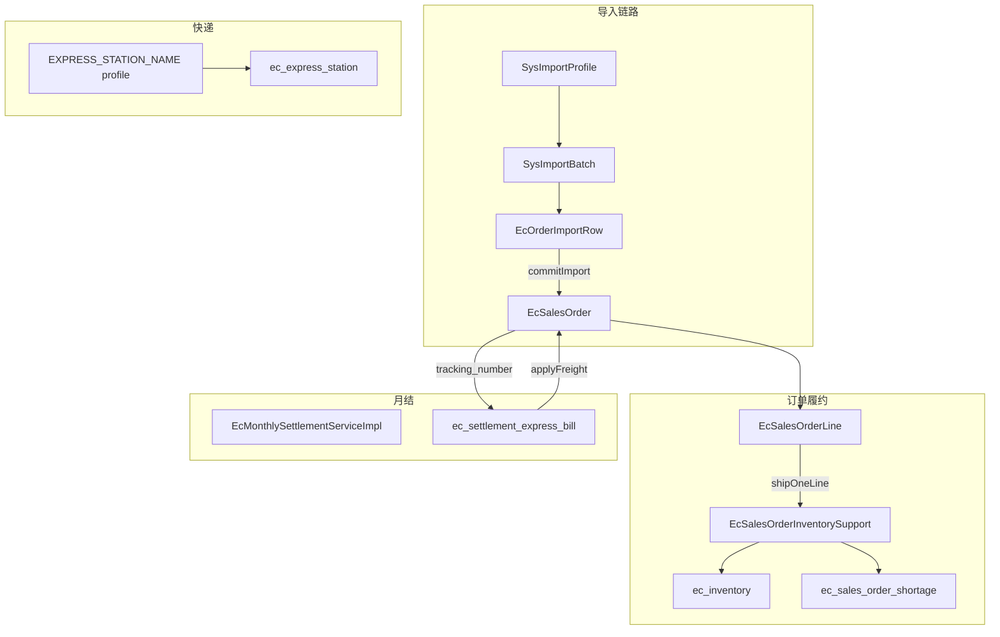

# 电商平台第一期优化 2

---

## 一、文档说明

本文档基于 `admin-backend` / `admin-web` 电商模块的**代码审计与近期迭代**，在《电商平台第一期优化.md》基础上补充：

1. **本阶段已落地能力**（快递别名、重复导入覆盖、1688 卖家备注等）
2. **当前仍待优化项**（按 P0 / P1 / P2 优先级）
3. **Quick Wins 与较大重构**的分工建议
4. **建议实施路线**

**适用路径**：

| 模块 | 路径 |
|------|------|
| 后端 | `admin-backend/admin-system` |
| 前端 | `admin-web` |
| SQL | `admin-backend/sql/` |

**文档版本**: v1.0  
**创建日期**: 2026-06-02

---

## 二、模块现状概览

### 2.1 已形成闭环的能力

```text
商品(SPU/SKU) → 上架链接 → 销售订单 → 库存扣减/欠货
                    ↓
              Excel 导入(sys_import_profile)
                    ↓
         月结统计 ← 快递账单导入 → 运单号回填真实运费
                    ↓
              快递站点(价格/须知/别名/面单价)
```

### 2.2 核心模块清单

| 领域 | 关键类/页面 | 说明 |
|------|-------------|------|
| 销售订单 | `EcSalesOrderServiceImpl`、`SalesOrderPanel.vue` | CRUD、导入、发货、退款 |
| 导入配置 | `SysImportServiceImpl`、`ImportMappingDialog.vue` | `SALES_ORDER` / `SETTLEMENT_EXPRESS_BILL` / `EXPRESS_STATION_NAME` |
| 月结 | `EcMonthlySettlementServiceImpl`、`MonthlySettlementPanel.vue` | 汇总、买家排除、账单导入 |
| 快递 | `EcExpressStationServiceImpl`、`ExpressPanel.vue` | 站点、价格、须知、导入名称别名 |
| 库存 | `EcInventoryServiceImpl`、`InventoryPanel.vue` | 库存、进货、盘点、流水 |

### 2.3 架构优点

- Support 类拆分方向正确（匹配、定价、库存、解析）
- 导入配置统一到 `sys_import_profile`，按 `biz_type + scope_key` 扩展
- 前端 `usePagination`、i18n 骨架、API 分层较清晰

### 2.4 主要短板（审计结论）

| 类别 | 描述 |
|------|------|
| 数据一致性 | 导入「已发货/已完成」未扣库存；导入退款未算亏损 |
| 并发安全 | 库存扣减 read-modify-write，无原子 SQL / 乐观锁 |
| 删除约束 | `deleteOrder` 未限制状态，未级联清理欠货/扣减 |
| 前端闭环 | 订单 confirm/ship/refund API 已有，UI 未接入 |
| 性能 | 8 Tab 同时挂载首屏多请求；导入 N+1 链接匹配 |
| 可维护性 | `EcSalesOrderServiceImpl` ~1700 行；状态字符串三套并存 |

---

## 三、本阶段已落地优化

以下能力已在近期迭代中实现，供联调与验收参考。

### 3.1 快递站点导入名称别名

**背景**：同一快递站在不同平台/Excel 中名称不同，订单导入 `express_station_name` 仅精确匹配站点名。

**方案**：

- `sys_import_profile`：`biz_type = EXPRESS_STATION_NAME`，`scope_key = express_station:{站点ID}`
- `value_mapping`：`{ "圆通速递": "站点ID", ... }`
- 配置入口：**快递管理 → 站点基本信息 → 导入名称别名**
- 解析顺序：精确匹配 `ec_express_station.name` → 别名映射

**关键文件**：

- `ExpressStationNameAliasSupport.java`
- `ExpressPanel.vue`
- `ec_express_station_name_alias.sql`（说明，无需改表）

### 3.2 订单重复导入覆盖（非追加）

**背景**：同平台单号重复导入时，`appendImportLines` 追加明细，导致同一 SKU 重复。

**方案**：

- 同店铺 + 同 `platform_order_no` 已存在 → **覆盖整单**（更新头、删旧明细、按新文件重建）
- 同单内按明细键去重（`listingLinkSkuId` 或 `链接名+规格`，后者覆盖前者）
- 已发货扣减库存的订单拒绝覆盖，并提示

**关键文件**：`EcSalesOrderServiceImpl.replaceOrderFromImportRows`

### 3.3 1688 卖家备注 → 手动填写成本

**背景**：1688 订单含卖家备注时，自动匹配成本不可靠，需人工确认。

**方案**：

- 订单头字段 `seller_remark`（schema 已有）
- 导入列映射新增 `seller_remark` / `buyer_remark`
- **仅 1688 平台**：任一明细行有卖家备注 → 整单所有行 `matchStatus = UNMATCHED`，须填手动成本后入库
- 入库时写入订单头 `seller_remark`

**关键文件**：

- `EcSalesOrderServiceImpl.collect1688OrdersWithSellerRemark`
- `SalesOrderPanel.vue`（详情与导入预览展示）
- `ec_sales_order_seller_remark.sql`（旧库补列）

### 3.4 快递账单导入（前期已完成，本阶段相关）

- 明细表、列映射统一到 `sys_import_profile`
- 重复导入同月同站点同运单号 → **覆盖**旧值
- 手动 Tab：当月已发货且真实运费为 0 的订单
- 快递公司筛选（含「其他快递公司」）

**SQL 执行顺序（若未跑）**：

1. `ecommerce_monthly_settlement.sql`
2. `ec_settlement_express_bill_enhance.sql`
3. `ec_settlement_express_bill_line_extend.sql`
4. `ec_express_station_label_price.sql`
5. `ec_settlement_express_bill_station_filter.sql`

---

## 四、待优化项（按优先级）

### 4.1 P0 — 数据正确性（建议优先）

#### 4.1.1 导入 SHIPPED/COMPLETED 未扣库存

| 项 | 说明 |
|----|------|
| **问题** | `applyImportedLineStatus` 只改状态与 `shippedQuantity`，不调用 `shipOneLine` / `deductSkuCode` |
| **影响** | 导入已发货订单后库存虚高，欠货缺失 |
| **文件** | `EcSalesOrderServiceImpl.applyImportedLineStatus`、`EcSalesOrderInventorySupport` |
| **Quick Win** | 导入 commit 后对 SHIPPED/COMPLETED 行调用统一 `fulfillLine()` |
| **大改** | 引入「履约事件」模型，导入/手工/API 共用状态机 |

#### 4.1.2 库存扣减无并发控制

| 项 | 说明 |
|----|------|
| **问题** | `deductSkuCode` 为 read-modify-write，无 `SELECT FOR UPDATE` / 乐观锁 |
| **影响** | 并发发货可能超卖 |
| **Quick Win** | `UPDATE quantity = quantity - ? WHERE sku_code = ? AND quantity >= ?` |
| **大改** | `version` 列 + 重试，或 Redis 分布式锁 |

#### 4.1.3 订单删除缺少约束与级联

| 项 | 说明 |
|----|------|
| **问题** | `deleteOrder` 未用 `requireDraftOrder`；不清理欠货/扣减；已扣库存不回滚 |
| **Quick Win** | 限制「仅草稿可删」或「无扣减记录才可删」 |
| **大改** | 软删除 + 审计 + 库存回滚流程 |

#### 4.1.4 导入 REFUNDED/RETURNED 未算亏损

| 项 | 说明 |
|----|------|
| **问题** | 手工 `refundLine` 会算 `lossAmount`；导入路径只设 status |
| **影响** | 月结成本、退款亏损统计失真 |
| **Quick Win** | 导入 commit 后对退款行复用 `refundLine` 定价逻辑 |
| **大改** | 统一 `applyLineFinancials(line, context)` |

---

### 4.2 P1 — 体验与性能

#### 后端

| 项 | 说明 | 文件 |
|----|------|------|
| 导入 N+1 | 每行 `matchLinkSku` 多次 DB 查询 | `processImportRows`、`EcSalesOrderMatchSupport` |
| 库存汇总 | `pageInventories` 全量 list 再内存 SUM | `EcInventoryServiceImpl.buildInventorySummary` |
| 运单号匹配 | `REPLACE(tracking_number,' ','')` 无法走索引 | `EcMonthlySettlementServiceImpl.findOrdersByTracking` |
| 状态常量重复 | 枚举存在但 Service 仍硬编码字符串 | `EcSalesOrderStatus`、`EcImportStatusSupport` |
| 订单号生成 | `count+1` 无冲突重试 | `EcSalesOrderServiceImpl.generateOrderNo` |
| 月结重复查询 | 同月订单被多次加载 | `EcMonthlySettlementServiceImpl` |

**Quick Wins**：

- 按 `shopId` 预加载 link/sku Map（导入匹配）
- 库存汇总改 SQL `SUM`
- 入库/导入时规范化 `tracking_number`，去掉 REPLACE 回退
- 补索引：`(shop_id, order_time, status)`、`ec_inventory_log(ref_type, ref_id)`、买家排除唯一键

#### 前端

| 项 | 说明 | 文件 |
|----|------|------|
| Tab 非懒加载 | 进入 `/ecommerce` 8 面板同时 `onMounted` 打 API | `EcommerceView.vue` |
| 订单操作 UI 缺失 | confirm/ship/refund API 未接入 | `SalesOrderPanel.vue`、`salesOrder.ts` |
| 列表无空状态 | 仅 loading，无 `el-empty` | 各 Panel |
| 编辑无 loading | `openEdit` 无 `v-loading` | `ProductPanel`、`SalesOrderPanel` |
| 建单 N+1 | 每个 link 再 `fetchListingLink` | `SalesOrderPanel.loadLinkSkuOptions` |
| i18n 缺口 | en-US 缺键、部分硬编码中文 | `zh-CN.ts`、`en-US.ts`、`request.ts` |
| 盘点 drawer | 关闭即刷新父列表 | `StocktakeOrderDrawer.vue` |

**Quick Wins**：

1. `EcommerceView` 各 `el-tab-pane` 加 `lazy`
2. 订单详情接入确认/发货/退款（i18n 已备）
3. 主列表加 `el-empty`；详情/编辑加 `v-loading`
4. 补全 en-US；`formatMoney` 抽到 `utils/formatMoney.ts`
5. `StocktakeOrderDrawer` 仅在 mutation 成功后刷新

---

### 4.3 P2 — 架构与可维护性

#### 后端

| 项 | 说明 |
|----|------|
| God Class | `EcSalesOrderServiceImpl` 承担 CRUD + 导入 + 状态机 + 定价 |
| 状态机分散 | 导入/手工/API 三条履约路径逻辑不一致 |
| SQL 分散 | 多个 `ecommerce_*.sql` + `alter`，新环境易漏执行 |
| 无外键 | 订单行、欠货、扣减、账单行无 FK，孤儿数据风险 |
| 运费分摊 | `allocateFreight` 按行数均分，非重量/金额加权 |
| DTO 无校验 | 无 `@Valid`，校验全在 Service imperative |
| 大事务 | `importExpressBill` 整文件单事务，大账单长锁 |

**建议拆分**：

```text
EcSalesOrderServiceImpl
  → OrderCommandService      # CRUD、确认、取消
  → OrderImportService       # 预览、commit、覆盖
  → OrderFulfillmentService  # 发货、扣库存、欠货
  → OrderPricingFacade       # 行定价、重算、退款亏损
```

#### 前端

| 项 | 说明 |
|----|------|
| 大组件 | `SalesOrderPanel`(1072)、`ProductPanel`(874)、`ExpressBillImportDialog`(688) |
| Options 重复拉取 | `fetchFactoryOptions` / `fetchShopOptions` 多组件各自 onMounted |
| 表单校验 | 全模块无 `el-form :rules` |
| 上架链接入口 | 藏在商品管理子 Tab，与订单/月结权重不匹配 |

---

### 4.4 P3 — 业务增强（按需）

| 方向 | 说明 |
|------|------|
| 月结性能 | 按店铺循环全量加载 → SQL 聚合或异步批处理 |
| 账单运单唯一 | `ec_settlement_express_bill_line(bill_id, tracking_number)` 唯一约束 |
| 平台单号 NULL | MySQL UNIQUE 允许多 NULL，空平台单号无法 DB 级去重 |
| 库存反向操作 | 退款/取消时 reclaim 库存、核销欠货（见第一期优化文档 2.3） |
| 权限与多租户 | RBAC、`@PreAuthorize`（见第一期优化文档 第四节） |

---

## 五、Quick Wins vs 较大重构

### 5.1 Quick Wins（约 1–3 天/项）

| # | 任务 | 端 |
|---|------|-----|
| 1 | 导入 SHIPPED/COMPLETED 后扣库存 | 后端 |
| 2 | 库存扣减改原子 SQL | 后端 |
| 3 | `deleteOrder` 加状态/扣减校验 | 后端 |
| 4 | 导入退款行补算 `loss_amount` | 后端 |
| 5 | 库存汇总 SQL 聚合 | 后端 |
| 6 | 导入预加载 link/sku Map | 后端 |
| 7 | 运单号规范化 + 去 REPLACE 查询 | 后端 |
| 8 | 补复合索引 / 买家排除唯一键 | SQL |
| 9 | `EcommerceView` Tab `lazy` | 前端 |
| 10 | 订单详情操作 UI | 前端 |
| 11 | 列表 empty / 编辑 loading / i18n 补洞 | 前端 |

### 5.2 较大重构（需设计 + 测试周期）

| # | 任务 |
|---|------|
| 1 | 统一订单履约状态机（导入/手工/API 一条路径） |
| 2 | 拆分 `EcSalesOrderServiceImpl` |
| 3 | 合并 SQL migration 为有序版本链 + 可选 FK |
| 4 | 月结计算引擎 SQL 化 / 异步批处理 |
| 5 | 并发发号 + 幂等发货体系 |
| 6 | 大组件拆分 + composable 抽取 |

---

## 六、建议实施路线

```text
第 1 周 — 数据正确性
├── 导入已发货扣库存 (#4.1.1)
├── 库存原子扣减 (#4.1.2)
├── 删除约束 (#4.1.3)
└── 导入退款算亏损 (#4.1.4)

第 2 周 — 前端体验 + 性能 Quick Wins
├── Tab lazy + 订单操作 UI
├── empty / loading / i18n
├── 导入预加载 link/sku
└── 库存汇总 SQL 化

第 3 周+ — 架构
├── 拆分 SalesOrder 服务
├── 统一状态机
├── SQL migration 整理
└── 大组件拆分
```

---

## 七、架构关系简图



---

## 八、关键文件索引

| 模块 | 文件 |
|------|------|
| 月结/账单 | `EcMonthlySettlementServiceImpl.java`、`ExpressBillImportDialog.vue` |
| 账单解析 | `EcExpressBillParseSupport.java`、`ExpressBillStationFilter.java` |
| 订单导入/覆盖 | `EcSalesOrderServiceImpl.java` |
| 站点别名 | `ExpressStationNameAliasSupport.java`、`ExpressPanel.vue` |
| 导入 profile | `SysImportServiceImpl.java`、`SysImportFieldRegistry.java` |
| 前端 import API | `admin-web/src/api/sys/import.ts` |
| 订单面板 | `SalesOrderPanel.vue` |

---

## 九、与第一期优化文档的关系

| 文档 | 侧重 |
|------|------|
| 《电商平台第一期优化.md》 | 状态枚举、状态机、库存反向、月结拆分、工程化（乐观锁/幂等/RBAC） |
| 《电商平台第一期优化 2.md》（本文） | 审计结论、本阶段已落地项、P0–P3 待办、Quick Wins 清单 |

两文档可合并排期：优先完成本文 **P0 四项** 与 **前端 Tab lazy + 订单操作 UI**，再推进第一期文档中的状态机与库存反向操作。

---

**文档版本**: v1.0  
**创建日期**: 2026-06-02  
**维护**: 随电商模块迭代更新「第三节 已落地」与「第四节 待优化」状态
