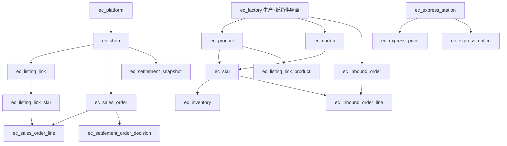

# 电商数据迁移对照：kyle-e-commerce → ai_manager_admin

> 生成日期：2026-06-30  
> 源库：`kyle-e-commerce`（旧系统）  
> 目标库：`ai_manager_admin`（当前项目）

本文档对比两个本地 MySQL 库中电商相关表结构，提供字段级映射关系，并标注目标库中无法从旧库直接获取的字段，供数据迁移脚本编写参考。

---

## 一、总体概览

### 1.1 kyle-e-commerce 电商表（`e_*`）及数据量

| 旧表 | 行数 | 业务含义 | 建议映射到新表 |
|------|------|----------|----------------|
| `e_platform_info` | 5 | 平台 | `ec_platform` |
| `e_shop` | 5 | 店铺 | `ec_shop` |
| `e_product_company` | 16 | 生产厂家 | `ec_factory`（`factory_type=PRODUCTION`） |
| `e_box_company` | 2 | 纸箱供应商 | `ec_factory`（`factory_type=CUSTOMER` 或单独供应商） |
| `e_product_info` | 31 | SPU 产品 | `ec_product` |
| `e_product_item` | 201 | SKU 货号 | `ec_sku` |
| `e_box_item` | 14 | 纸箱规格 | `ec_carton` |
| `e_express_site` | 3 | 快递站点 | `ec_express_station` |
| `e_express_item` | 62 | 省份运费价目 | `ec_express_price` |
| `e_express_remark` | 11 | 站点须知 | `ec_express_notice` |
| `e_inventory` | 200 | 库存 | `ec_inventory` |
| `e_inventory_records` | 0 | 库存变动记录 | `ec_inventory_log`（结构差异大） |
| `e_shelf_plan` | 52 | 上架链接 | `ec_listing_link` |
| `e_shelf_sku` | 374 | 链接 SKU | `ec_listing_link_sku` |
| `e_real_order` | 2299 | 真实订单（扁平） | `ec_sales_order` + `ec_sales_order_line` |
| `e_purchase_records` | 316 | 采购/入库记录 | `ec_inbound_order` + `ec_inbound_order_line` |
| `e_month_order` | 43 | 月结汇总 | `ec_settlement_snapshot`（部分） |
| `e_order_classification_temp` | 138 | 月结订单分类 | `ec_settlement_order_decision`（部分） |
| `e_order_calculate_supplement` | 11 | 订单成本补录 | 回填 `ec_sales_order` 成本字段 |
| `e_self_purchase_order` | 2 | 刷单/自购 | **无对应表**，可跳过或手工录入 |

### 1.2 ai_manager_admin 无直接旧表来源的新表（17 张）

| 新表 | 说明 | 迁移策略 |
|------|------|----------|
| `ec_listing_link_product` | 链接关联 SPU | 由 `e_shelf_sku.product_nos` 反查 `e_product_item` 生成 |
| `ec_sales_order_line` | 订单明细 | 由 `e_real_order` 一对一拆行 |
| `ec_inbound_order_line` | 入库明细 | 由 `e_purchase_records` 拆行 |
| `ec_outbound_order` / `ec_outbound_order_line` | 出货单 | 旧库无，默认空 |
| `ec_stocktake_order` / `ec_stocktake_order_line` | 盘点单 | 旧库无，默认空 |
| `ec_order_import_row` | 导入中间行 | 旧库无 |
| `ec_sales_order_shortage` | 欠货 | 旧库无 |
| `ec_sales_order_inventory_deduct` | 扣库存记录 | 旧库无 |
| `ec_settlement_buyer_exclude` | 月结买家排除 | 旧库无 |
| `ec_settlement_express_bill` / `ec_settlement_express_bill_line` | 快递账单 | 旧库无 |
| `ec_settlement_order_decision` | 月结纳入决策 | 部分来自 `e_order_classification_temp` |
| `ec_settlement_snapshot` | 月结快照 | 部分来自 `e_month_order` |
| `ec_purchase_order_config` | 采购单模板 | 旧库无，用默认值 |
| `ec_system_config` | 系统配置 | 旧库无，用默认值 |

### 1.3 通用字段转换规则

| 旧字段 | 新字段 | 说明 |
|--------|--------|------|
| `is_deleted` | `deleted` | 语义相同 |
| `gmt_created` | `create_time` | timestamp → datetime |
| `gmt_modified` | `update_time` | timestamp → datetime |

---

## 二、表级字段对应

### 2.1 `ec_platform` ← `e_platform_info`

| 新字段 | 旧字段 | 类型变化 | 备注 |
|--------|--------|----------|------|
| `id` | `id` | 保持 | 建议保留原 ID |
| `name` | `name` | varchar(128)←varchar(64) | |
| `name_en` | `name_en` | varchar(128)←varchar(64) | |
| `platform_code` | `platform_type` | int | 字典 `e_platform_type`：1淘宝/2阿里/3拼多多 |
| `remark` | `remark` | varchar(512)←varchar(256) | |
| `deleted` | `is_deleted` | tinyint | |
| `create_time` | `gmt_created` | datetime←timestamp | |
| `update_time` | `gmt_modified` | datetime←timestamp | |

**新库独有（旧库无来源，需默认值）：**

| 字段 | 建议默认值 |
|------|------------|
| `avatar_url` | NULL |
| `channel_type` | `'ONLINE'` |
| `status` | `'ENABLED'` |

---

### 2.2 `ec_shop` ← `e_shop`

| 新字段 | 旧字段 | 备注 |
|--------|--------|------|
| `id` | `id` | |
| `name` | `name` | |
| `name_en` | `name_en` | |
| `platform_id` | `platform` | 旧为 int，新为 bigint FK |
| `remark` | `remark` | |
| `deleted` | `is_deleted` | |
| `create_time` | `gmt_created` | |
| `update_time` | `gmt_modified` | |

**新库独有（16 个字段，旧库无）：**

`avatar_url`、`category_commission_pct`、`tech_service_fee_pct`、`payment_fee_pct`、`promotion_fee_pct`、`fulfillment_fee_pct`、`return_service_fee_pct`、`installment_fee_pct`、`activity_service_fee_pct`、`annual_platform_fee`、`deposit_amount`、`shipping_insurance_fee`、`other_fee_pct`、`other_fee_remark`、`default_receive_province`（默认 `'广东省'`）、`status`（默认 `'ENABLED'`）

---

### 2.3 `ec_factory` ← `e_product_company`（+ 可选 `e_box_company`）

**生产工厂（`e_product_company`）：**

| 新字段 | 旧字段 | 备注 |
|--------|--------|------|
| `id` | `id` | |
| `name` | `name` | |
| `contact_name` | `contact` | |
| `contact_phone` | `mobile` | |
| `address` | `address` | |
| `remark` | `remark` | |
| `deleted` | `is_deleted` | |
| `create_time` | `gmt_created` | |
| `update_time` | `gmt_modified` | |

**新库独有：**

| 字段 | 建议值 |
|------|--------|
| `factory_type` | `'PRODUCTION'` |
| `status` | `'ENABLED'` |

**纸箱供应商（`e_box_company`）→ 可迁入 `ec_factory`：**

| 新字段 | 旧字段（e_box_company） |
|--------|-------------------------|
| `name` | `name` |
| `contact_phone` | `mobile` |
| `address` | `address` |
| `remark` | `remark` |
| `factory_type` | 固定 `'CUSTOMER'` |

旧库 `threshold`（阈值）、`discount`（折扣）、`is_default` 在新库无对应字段，可写入 `remark` 或丢弃。

---

### 2.4 `ec_product` ← `e_product_info`

| 新字段 | 旧字段 | 备注 |
|--------|--------|------|
| `id` | `id` | |
| `name` | `name` | |
| `factory_id` | `product_company_id` | |
| `rebate_pct` | `rebate` | 旧 decimal(6,2)%，新 decimal(5,2)% |
| `deleted` | `is_deleted` | |
| `create_time` | `gmt_created` | |
| `update_time` | `gmt_modified` | |

**新库独有：**

| 字段 | 建议值 |
|------|--------|
| `description` | `remark` 可迁入，或 NULL |
| `image_name` | NULL（旧 SPU 无图） |
| `status` | `'ENABLED'` |

---

### 2.5 `ec_sku` ← `e_product_item`

| 新字段 | 旧字段 | 转换说明 |
|--------|--------|----------|
| `id` | `id` | |
| `product_id` | `product_id` | |
| `sku_code` | `product_no` | 货号 |
| `spec_name` | `name` | SKU 名称 |
| `image_name` | `product_img` | 需处理 COS 前缀（见 `sys_app_settings_info.pic_prefix`） |
| `sale_price` | `price` | |
| `rebate_pct` | `rebate` | SKU 级退点优先于 SPU |
| `carton_gross_weight_kg` | `gross_weight` | |
| `carton_net_weight_kg` | `net_weight` | |
| `units_per_carton` | `inner_boxes_number` | 默认 1 |
| `deleted` | `is_deleted` | |
| `create_time` | `gmt_created` | |
| `update_time` | `gmt_modified` | |

**需计算/关联的字段：**

| 新字段 | 来源 | 转换 |
|--------|------|------|
| `carton_id` | `e_shelf_sku.package_no` 或 `e_box_item.id` | 通过货号关联纸箱 |
| `carton_length_cm` 等 | `outer_specifications` | 解析如 `53*29*37` |
| `product_length_cm` 等 | `product_specifications` / `product_weight` | 旧库多为文本/重量，尺寸可能需补 NULL |

**新库独有：**

| 字段 | 建议值 |
|------|--------|
| `status` | `'ON_SALE'` |

旧字段 `boxes_number`、`packing_type`（字典 `e_packing_type`）在新库无直接列。

---

### 2.6 `ec_carton` ← `e_box_item`

| 新字段 | 旧字段 | 转换 |
|--------|--------|------|
| `id` | `id` | |
| `factory_id` | `parent_id` | 指向 `e_box_company.id`（迁入后映射 `ec_factory.id`） |
| `name` | `name` | 如「1号纸箱」 |
| `unit_price` | `price` | |
| `remark` | `remark` | |
| `length_cm` | `size` | 解析 `53*29*37` → 长/宽/高 |
| `width_cm` | `size` | 同上 |
| `height_cm` | `size` | 同上 |
| `deleted` | `is_deleted` | |
| `create_time` | `gmt_created` | |
| `update_time` | `gmt_modified` | |

**新库独有：**

| 字段 | 建议值 |
|------|--------|
| `illustration_variant` | NULL 或 0 |
| `preview_image` | NULL |

---

### 2.7 `ec_express_station` ← `e_express_site`

| 新字段 | 旧字段 |
|--------|--------|
| `id` | `id` |
| `name` | `name` |
| `contact` | `mobile` |
| `address` | `address` |
| `is_default` | `is_default` |
| `label_price` | `page_price` |
| `deleted` | `is_deleted` |
| `create_time` | `gmt_created` |
| `update_time` | `gmt_modified` |

**新库独有：** `avatar_url` → NULL

---

### 2.8 `ec_express_price` ← `e_express_item`

| 新字段 | 旧字段 |
|--------|--------|
| `id` | `id` |
| `station_id` | `parent_id` |
| `province_name` | `provinces` |
| `price_w03_kg` | `kg03` |
| `price_w05_kg` | `kg05` |
| `price_w1_kg` | `kg10` |
| `price_w15_kg` | `kg15` |
| `price_w2_kg` | `kg20` |
| `price_w25_kg` | `kg25` |
| `price_w3_kg` | `kg30` |
| `over3_first_price` | `fisrt_3kg`（旧库拼写错误保留） |
| `over3_additional_price` | `next_3kg` |
| `deleted` | `is_deleted` |
| `create_time` | `gmt_created` |
| `update_time` | `gmt_modified` |

此表字段可 **100% 映射**。

---

### 2.9 `ec_express_notice` ← `e_express_remark`

| 新字段 | 旧字段 |
|--------|--------|
| `id` | `id` |
| `station_id` | `parent_id` |
| `content` | `remark` |
| `highlight_red` | `red` |
| `sort_order` | `order` |
| `deleted` | `is_deleted` |
| `create_time` | `gmt_created` |
| `update_time` | `gmt_modified` |

此表字段可 **100% 映射**。

---

### 2.10 `ec_inventory` ← `e_inventory`

| 新字段 | 旧字段 |
|--------|--------|
| `id` | `id` |
| `sku_code` | `sku_no` |
| `quantity` | `inventory` |
| `alert_threshold` | `warning_threshold` |
| `ignore_alert` | `ignore_warning` |
| `deleted` | `is_deleted` |
| `create_time` | `gmt_created` |
| `update_time` | `gmt_modified` |

此表字段可 **100% 映射**。

---

### 2.11 `ec_listing_link` ← `e_shelf_plan`

| 新字段 | 旧字段 |
|--------|--------|
| `id` | `id` |
| `name` | `name` |
| `shop_id` | `shop_id` |
| `listing_time` | `shelf_time` |
| `deleted` | `is_deleted` |
| `create_time` | `gmt_created` |
| `update_time` | `gmt_modified` |

**新库独有：**

| 字段 | 建议值 |
|------|--------|
| `platform_url` | NULL |
| `remark` | NULL |
| `status` | `'ENABLED'` |

---

### 2.12 `ec_listing_link_sku` ← `e_shelf_sku`

| 新字段 | 旧字段 | 转换 |
|--------|--------|------|
| `id` | `id` | |
| `link_id` | `parent_id` | |
| `sku_name` | `name` | |
| `sku_codes` | `product_nos` | 逗号分隔货号 |
| `discount_pct` | `discount` | 旧 50.00 = 5折 → 新 `discount_pct=50.00` |
| `coupon_amount` | `coupon` | |
| `actual_set_amount` | `actual_price` | 实际出售价 |
| `deleted` | `is_deleted` | |
| `create_time` | `gmt_created` | |
| `update_time` | `gmt_modified` | |

**可推导字段：**

| 新字段 | 来源 |
|--------|------|
| `min_set_amount` | `display_price`（标价） |
| `cost_price` / `base_cost_amount` / `platform_fee_amount` / `profit` | 迁移后由系统重算，或迁后批量计算 |

**新库独有：** `sort_order` → 默认 0

旧字段 `package_no`（纸箱号）→ 用于设置 `ec_sku.carton_id`，不写入 `ec_listing_link_sku`。

---

### 2.13 `ec_listing_link_product`（无旧表，需生成）

| 新字段 | 生成逻辑 |
|--------|----------|
| `link_id` | `e_shelf_sku.parent_id` |
| `product_id` | 从 `product_nos` 拆货号 → 查 `e_product_item.product_id` → 去重 |
| `sort_order` | 按出现顺序 0,1,2… |

---

### 2.14 `ec_sales_order` ← `e_real_order`（扁平 → 头表）

| 新字段 | 旧字段 | 转换 |
|--------|--------|------|
| `platform_order_no` | `order_no` | 旧 order_no 即平台单号 |
| `order_time` | `order_time` | |
| `shop_id` | `shop_id` | |
| `express_station_id` | `express_site_id` | |
| `tracking_number` | `express_no` | |
| `received_amount` | `order_amount` | |
| `total_cost_amount` | `cost` | 产品及包装成本 |
| `actual_freight_amount` | `express_cost` | |
| `deleted` | `is_deleted` | |
| `create_time` | `gmt_created` | |
| `update_time` | `gmt_modified` | |

**需生成/映射：**

| 新字段 | 逻辑 |
|--------|------|
| `id` | 可保留旧 `id` 或重新生成 |
| `order_no` | 新生成 `SOyyyyMMddxxxx` |
| `source` | `'IMPORT'` 或 `'MANUAL'` |
| `status` | 见下方状态映射 |
| `platform_status` | 字典 `e_order_status` 文案 |
| `estimated_freight_amount` | 同 `express_cost` 或 0 |

**`e_order_status` → `ec_sales_order.status` 映射：**

| 旧值 | 旧含义 | 新 status |
|------|--------|-----------|
| 0 | 空白 | `DRAFT` |
| 1 | 已签收，退款成功 | `REFUNDED` |
| 2 | 已签收 | `COMPLETED` |
| 3 | 已发货，退款成功 | `PARTIAL_REFUND` |
| 4 | 已取消 | `CANCELLED` |
| 5 | 退款成功 | `REFUNDED` |

**新库独有（25 个字段，旧库无）：**

`pay_time`、`ship_time`、`complete_time`、`buyer_name`、`buyer_phone`、`receive_province`、`receive_city`、`receive_district`、`receive_address`、`buyer_remark`、`seller_remark`、`freight_amount`、`order_coupon_amount`、`platform_fee_amount`、`profit_amount`、`total_loss_amount`、`has_shortage`、`import_batch_id`、`platform_raw_json`

旧字段 `order_title`、`sku_name`、`sku_number` → 进入 `ec_sales_order_line`。

---

### 2.15 `ec_sales_order_line` ← `e_real_order`（1:1 拆行）

| 新字段 | 旧字段 / 来源 |
|--------|---------------|
| `order_id` | `e_real_order.id` → `ec_sales_order.id` |
| `link_name` | `order_title` |
| `sku_spec_name` | `sku_name` |
| `sku_quantity` | `sku_number` |
| `line_received_amount` | `order_amount` |
| `unit_price` | `order_amount / sku_number` |
| `status` | 由订单 status 推导 |
| `listing_link_sku_id` | 按 `shop_id` + `sku_name` 匹配 `e_shelf_sku` |

**新库独有（需迁后计算或留空）：**

`sort_order`、`shipped_quantity`、`short_quantity`、`platform_line_status`、`refund_type`、`refund_time`、`refund_amount`、`loss_amount`、`discount_pct`、`line_coupon_amount`、`sku_amount`、`carton_amount`、`express_amount`、`base_cost_amount`、`platform_fee_amount`、`cost_price`、`min_set_amount`、`profit`、`pricing_risk`、`platform_line_no`、`platform_item_name`、`sku_codes`

---

### 2.16 `ec_inbound_order` + `ec_inbound_order_line` ← `e_purchase_records`

旧表是「按 SKU 一条记录」，新表是「头表 + 明细」。建议按 `record_time`（同一天）或 `id` 分组生成入库单。

**头表 `ec_inbound_order`：**

| 新字段 | 旧字段 / 逻辑 |
|--------|---------------|
| `order_time` | `record_time` |
| `status` | `is_finished=1` → `CONFIRMED`，否则 `DRAFT` |
| `remark` | `remark` + `other_amount` 可拼接 |
| `order_no` | 新生成 `IByyyyMMddxxxx` |
| `factory_id` | 由 `sku_no` 反查 `e_product_item` → `e_product_info.product_company_id` |

**明细 `ec_inbound_order_line`：**

| 新字段 | 旧字段 |
|--------|--------|
| `order_id` | 生成的入库单 ID |
| `sku_code` | `sku_no` |
| `quantity` | `number` |
| `received_quantity` | `is_finished=1` 时 = `number`，否则 NULL |

**新库独有：** `expected_delivery_time`、`actual_receipt_time`

---

### 2.17 月结相关（部分映射）

**`ec_settlement_snapshot` ← `e_month_order`：**

| 新字段 | 旧字段 |
|--------|--------|
| `settlement_month` | `month`（`2024-07` → `2024-07`） |
| `snapshot_json` | 将 `profit_actual/turnover_actual/cost_*` 等序列化为 JSON |
| `calculated_at` | `gmt_modified` |

**`ec_settlement_order_decision` ← `e_order_classification_temp`：**

| 新字段 | 旧字段 |
|--------|--------|
| `shop_id` | 通过 `order_id` 关联 `e_real_order.shop_id` |
| `order_id` | `order_id` |
| `settlement_month` | 从关联月结或订单时间推导 |
| `included` | `can_calculate`（1=纳入，0=排除） |

**`e_order_calculate_supplement` → 回填订单成本：**

| 旧字段 | 回填到新表字段 |
|--------|----------------|
| `product_cost` | `ec_sales_order_line.base_cost_amount` 或 `cost` |
| `budget_express_cost` | `ec_sales_order.estimated_freight_amount` |
| `real_express_cost` | `ec_sales_order.actual_freight_amount` |
| `package_cost` | 计入 `total_cost_amount` |

---

## 三、新库字段缺口汇总（按表）

以下为 **ai_manager_admin 中有、但 kyle-e-commerce 中找不到直接来源** 的字段：

| 新表 | 无旧来源字段数 | 主要缺失字段 |
|------|----------------|--------------|
| `ec_platform` | 3 | `avatar_url`, `channel_type`, `status` |
| `ec_shop` | 16 | 全部费率字段、`avatar_url`、`status`、`default_receive_province` |
| `ec_factory` | 2 | `factory_type`, `status` |
| `ec_product` | 3 | `description`, `image_name`, `status` |
| `ec_sku` | 8 | `carton_id`, 产品/外箱尺寸 6 列, `status` |
| `ec_carton` | 5 | `length/width/height_cm`（需解析 size）, `illustration_variant`, `preview_image` |
| `ec_express_station` | 1 | `avatar_url` |
| `ec_listing_link` | 3 | `platform_url`, `remark`, `status` |
| `ec_listing_link_sku` | 6 | `min_set_amount`（可来自 display_price）, 成本/利润计算字段, `sort_order` |
| `ec_sales_order` | 25 | 买家/地址/利润/导入等全套新字段 |
| `ec_sales_order_line` | 34 | **整表无旧表**，由 `e_real_order` 拆行 + 匹配链接 SKU |
| `ec_inbound_order` | 8 | `order_no`, `factory_id`, 时间字段等需生成 |
| `ec_inventory_log` | 9 | **整表结构不同**，旧 `e_inventory_records` 为空 |
| 出货/盘点/导入/欠货/快递账单等 11 张表 | 全部 | **旧库无对应业务** |

---

## 四、旧库有、新库无直接列的数据

| 旧表/字段 | 处理建议 |
|-----------|----------|
| `e_box_company.threshold` / `discount` / `is_default` | 写入 `ec_factory.remark` 或丢弃 |
| `e_product_item.packing_type` | 字典值写入 `ec_sku` 无列，可忽略 |
| `e_product_item.boxes_number` | 装箱数，可映射逻辑参考 `units_per_carton` |
| `e_product_item.product_weight` | 无单独重量列，可用于运费试算备注 |
| `e_self_purchase_order`（刷单） | 单独业务，建议不迁或手工处理 |
| `sys_app_settings_info.pic_prefix` | 迁图片时拼接：`pic_prefix + product_img` → 下载后存新 uploads |
| `tool_dictionary` 中 `e_*` 枚举 | 用于状态/平台类型转换，不需迁表 |

### 4.1 旧系统字典参考（`tool_dictionary`）

**`e_platform_type`：**

| value | label |
|-------|-------|
| 1 | 淘宝 |
| 2 | 阿里巴巴 |
| 3 | 拼多多 |

**`e_order_status`：**

| value | label |
|-------|-------|
| 0 | 空白 |
| 1 | 已签收，退款成功 |
| 2 | 已签收 |
| 3 | 已发货，退款成功 |
| 4 | 已取消 |
| 5 | 退款成功 |

**`e_packing_type`：**

| value | label |
|-------|-------|
| 0 | 裸装 |
| 1 | OPP袋装 |
| 2 | PVC袋装 |
| 3 | 电商盒装 |
| 4 | 密封彩盒装 |
| 5 | 开窗彩盒装 |
| 6 | 围卡 |
| 7 | 蛋装 |
| 8 | PVC罩 |

---

## 五、推荐迁移顺序（满足外键）



1. **基础主数据**：平台 → 店铺 → 工厂 → 产品 → 纸箱 → SKU
2. **快递**：站点 → 价目 → 须知
3. **库存**：`ec_inventory`
4. **链接**：上架链接 → 链接 SKU → 链接产品关联
5. **订单**：销售订单头 → 明细（匹配 `listing_link_sku_id`）
6. **入库**：采购记录分组 → 入库单 + 明细
7. **月结**：快照 + 订单决策 + 成本补录回填
8. **配置**：`ec_purchase_order_config`、`ec_system_config` 用 SQL 默认值

---

## 六、关键转换 SQL 片段

### 6.1 解析纸箱尺寸

```sql
-- e_box_item.size = '53*29*37'
SET @size = '53*29*37';
SET @length_cm = CAST(SUBSTRING_INDEX(@size, '*', 1) AS DECIMAL(10,2));
SET @width_cm  = CAST(SUBSTRING_INDEX(SUBSTRING_INDEX(@size, '*', 2), '*', -1) AS DECIMAL(10,2));
SET @height_cm = CAST(SUBSTRING_INDEX(@size, '*', -1) AS DECIMAL(10,2));
```

### 6.2 订单状态 CASE

```sql
CASE e_real_order.order_status
  WHEN 0 THEN 'DRAFT'
  WHEN 1 THEN 'REFUNDED'
  WHEN 2 THEN 'COMPLETED'
  WHEN 3 THEN 'PARTIAL_REFUND'
  WHEN 4 THEN 'CANCELLED'
  WHEN 5 THEN 'REFUNDED'
  ELSE 'DRAFT'
END
```

### 6.3 图片路径

旧库为 COS URL 前缀 + 文件名（`sys_app_settings_info.pic_prefix` = `https://kyle-1257887000.cos.ap-nanjing.myqcloud.com/`），新库 `image_name` / `avatar_url` 仅存本地上传文件名。迁移时需下载转存到 `admin-backend/uploads/ecommerce/`。

---

## 七、数据量与工作量评估

| 模块 | 旧数据量 | 迁移难度 |
|------|----------|----------|
| 主数据（平台/店/厂/品/SKU/纸箱） | ~500 行 | 低，字段映射清晰 |
| 快递价目 | 62 行 | 低，完全对应 |
| 库存 | 200 行 | 低 |
| 上架链接+SKU | 426 行 | 中，需生成 `ec_listing_link_product` |
| 销售订单 | 2299 行 | **高**，扁平→头明细，缺买家地址/利润字段 |
| 采购记录 | 316 行 | 中，需分组生成入库单 |
| 月结 | 43+138 行 | 中，需组装 JSON 快照 |

---

## 八、待确认事项（编写迁移脚本前）

1. **是否保留原主键 ID**（建议保留，便于订单/链接关联追溯）
2. **图片是否从 COS 下载到本地**（影响 `ec_sku.image_name` 等字段）
3. **`e_box_company` 是否迁入 `ec_factory`**（纸箱供应商作为 CUSTOMER 类型）
4. **`e_purchase_records` 分组策略**（按天分组 vs 每条记录一张入库单）
5. **`e_self_purchase_order` 刷单数据** 是否迁移
