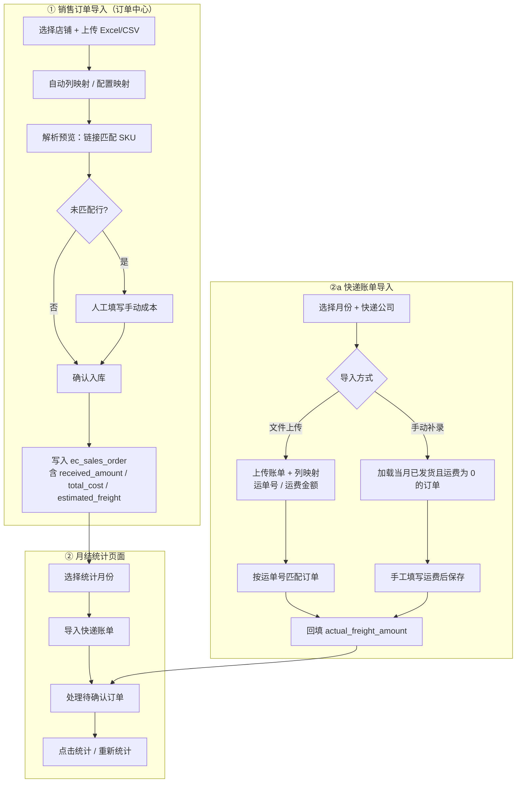

# 电商月结统计

---

## 一、文档说明

本文档说明电商模块**月结统计**的完整数据链路、导入流程、计算规则与推荐操作 SOP，供运营、财务联调与验收参考。

**适用路径**：

| 模块 | 路径 |
|------|------|
| 后端服务 | `admin-backend/admin-system/src/main/java/com/ai/manager/system/service/impl/EcMonthlySettlementServiceImpl.java` |
| 销售订单导入 | `admin-backend/admin-system/src/main/java/com/ai/manager/system/service/impl/EcSalesOrderServiceImpl.java` |
| 前端月结页 | `admin-web/src/views/ecommerce/MonthlySettlementPanel.vue` |
| 快递账单弹窗 | `admin-web/src/views/ecommerce/ExpressBillImportDialog.vue` |
| 订单中心 | `admin-web/src/views/ecommerce/SalesOrderPanel.vue` |
| SQL | `admin-backend/sql/ecommerce_monthly_settlement.sql` 等 |

**文档版本**: v1.0  
**创建日期**: 2026-06-28

---

## 二、业务闭环概览

月结统计依赖两条数据链路：

1. **销售订单导入**（订单中心）—— 提供营业额、商品成本、预估运费、订单状态  
2. **快递账单导入**（月结统计）—— 按运单号回填真实运费

```text
商品(SPU/SKU) → 上架链接 → 销售订单导入
                              ↓
                    月结统计 ← 快递账单导入 → 运单号回填 actual_freight
                              ↓
                    买家排除 / 待确认订单人工决策 → 纳入统计
```

**界面入口**：电商工作台 → **月结统计**（左右分栏：左侧「月结工作台」准备清单，右侧「统计结果」店铺汇总与明细）。

---

## 三、完整导入流程

### 3.1 总览流程图



### 3.2 销售订单导入（前置，订单中心）

**入口**：电商工作台 → 订单中心 → 导入订单

| 步骤 | 操作 | 后端逻辑 |
|------|------|---------|
| 1 | 选择店铺，上传文件 | `uploadImport`：解析 Excel/CSV，创建 `sys_import_batch` |
| 2 | 自动/手动列映射 | 按 `sys_import_profile`（`biz_type = SALES_ORDER`）映射字段 |
| 3 | 预览核对 | `previewImport` / `processImportRows`：链接名匹配 SKU；1688 平台若存在卖家备注，整单标记为 UNMATCHED |
| 4 | 填写未匹配成本 | 未匹配行须填 `manual_cost_price`；若配置了排除状态，未匹配行可默认成本为 0 |
| 5 | 确认入库 | `commitImport`：按平台单号分组建单；同店铺同平台单号已存在则**覆盖整单**（已发货扣库存的订单拒绝覆盖） |

**产出字段**（供月结使用）：

| 字段 | 说明 |
|------|------|
| `received_amount` | 实收金额（营业额） |
| `total_cost_amount` | 商品成本（SKU 匹配或手动成本汇总） |
| `estimated_freight_amount` | 预估运费（快递价格表估算） |
| `order_time` | 订单归属月份的依据 |
| `status` | 决定自动纳入 / 排除 / 待确认 |
| `buyer_name` | 用于买家排除名单匹配 |
| `tracking_number` | 用于快递账单运单号匹配 |

**相关表**：`ec_sales_order`、`ec_sales_order_line`、`sys_import_batch`、`ec_order_import_row`

### 3.3 快递账单导入（月结统计内）

**入口**：月结统计 → 左侧工作台「导入账单」，或准备清单中快递账单项的快捷操作

| 步骤 | 操作 | 后端逻辑 |
|------|------|---------|
| 1 | 选择月份 + 快递公司 | 文件导入须选择具体快递站点；「其他快递公司」仅支持手动模式 |
| 2a | **文件上传** | `importExpressBill`：解析运单号、运费；支持列映射、表头行/数据起始行配置 |
| 2b | **手动补录** | `prepareManualExpressBill`：列出当月已发货/已完成且 `actual_freight_amount` 为空或 0 的订单 |
| 3 | 运单号匹配 | 精确匹配 → 去空格匹配 → `REPLACE(tracking_number, ' ', '')` 匹配 |
| 4 | 回填运费 | 写入 `ec_sales_order.actual_freight_amount`；可选叠加站点**面单价** |
| 5 | 重复导入 | 同月同站点同运单号 → **覆盖**旧账单行与订单运费 |

**匹配状态**（`ec_settlement_express_bill_line.match_status`）：

| 状态 | 含义 |
|------|------|
| `MATCHED` | 运单号匹配到订单，运费已回填 |
| `UNMATCHED` | 账单行无对应订单 |
| `PENDING` | 手动补录待填写运费 |
| `APPLIED` | 手动保存后已应用到订单 |

**行来源**（`source`）：

| 来源 | 含义 |
|------|------|
| `FILE` | 账单文件解析 |
| `GAP_ORDER` | 当月已发货但账单未覆盖的订单 |
| `MANUAL` | 用户手动新增行 |

**运费叠加面单**：勾选「运费叠加面单价格」时，实际写入订单的运费 = 账单运费 + 站点 `label_price`。

**相关表**：`ec_settlement_express_bill`、`ec_settlement_express_bill_line`

### 3.4 月结辅助配置

| 配置 | 入口 | 作用 |
|------|------|------|
| 买家排除 | 月结工作台 → 配置 | `ec_settlement_buyer_exclude`：买家昵称精确匹配（trim），可按店铺或全平台生效 |
| 订单纳入决策 | 右侧店铺明细 → 待确认订单 Tab | `ec_settlement_order_decision`：按自然月 `YYYY-MM` 记录人工「纳入 / 不纳入」 |

---

## 四、计算方式

### 4.1 统计范围

- **时间维度**：`order_time ∈ [月初 00:00:00, 下月初 00:00:00)`，月份格式 `YYYY-MM`
- **统计粒度**：按店铺分别汇总；支持单店「重新统计」
- **实时性**：每次点击「统计」均为实时重算，无落库快照

### 4.2 订单分类规则

对当月该店铺的每一笔订单，按以下顺序判定（实现见 `EcMonthlySettlementServiceImpl.resolveAction`）：

```text
遍历当月该店铺所有订单
  │
  ├─ 买家在排除名单？ → 排除（excludedCount++）
  │
  ├─ 明细行存在 RETURNED 状态？ → 纳入亏损单（INCLUDE_LOSS，不计入营业额）
  │
  ├─ 状态 REFUNDED / CANCELLED？ → 自动排除
  │
  ├─ 状态 SHIPPED / COMPLETED？ → 自动纳入盈利单（INCLUDE_PROFIT）
  │
  ├─ 状态 DRAFT / PAID / PARTIAL_SHIPPED / PARTIAL_REFUND？
  │     ├─ 有人工决策「纳入」→ 纳入盈利单
  │     ├─ 有人工决策「不纳入」→ 排除
  │     └─ 无决策 → 待确认（pendingOrders，不计入汇总金额）
  │
  └─ 其他状态 + 人工决策纳入 → 纳入盈利单；否则排除
```

**状态常量**（后端）：

| 类型 | 状态值 |
|------|--------|
| 自动排除 | `REFUNDED`、`CANCELLED` |
| 自动纳入（盈利） | `SHIPPED`、`COMPLETED` |
| 待确认 | `DRAFT`、`PAID`、`PARTIAL_SHIPPED`、`PARTIAL_REFUND` |

### 4.3 金额公式

#### 纳入盈利单（INCLUDE_PROFIT）

```
营业额           += received_amount
预估成本         += total_cost_amount + estimated_freight_amount
实际成本         += total_cost_amount + actual_freight_amount
实际运费合计     += actual_freight_amount
```

#### 纳入亏损单（INCLUDE_LOSS，存在退货明细 RETURNED）

```
不计入营业额
预估成本         += total_cost_amount + estimated_freight_amount
实际成本         += total_cost_amount + actual_freight_amount
```

#### 店铺级汇总

```
预估总利润 = 总营业额 - 预估总成本
实际总利润 = 总营业额 - 实际总成本
```

#### 单笔预估利润（用于「最高利润单」）

```
预估利润 = received_amount - total_cost_amount - estimated_freight_amount
```

取当月纳入盈利单中预估利润最大者。

### 4.4 关键字段依赖

| 字段 | 来源 | 对统计的影响 |
|------|------|-------------|
| `received_amount` | 销售订单导入 / 手工录入 | 营业额 |
| `total_cost_amount` | SKU 匹配成本或手动成本 | 商品成本 |
| `estimated_freight_amount` | 快递价格表估算 | 预估成本、预估利润 |
| `actual_freight_amount` | 快递账单导入回填 | 实际成本、实际利润 |

> **注意**：未导入快递账单时，`actual_freight_amount` 多为 0 或空，**实际利润会偏高**。系统提示：「请先导入快递账单后重新统计」。左侧工作台快递账单项也会显示各站点匹配情况。

### 4.5 输出指标说明（店铺汇总）

| 指标 | 含义 |
|------|------|
| `totalRevenue` | 总营业额 |
| `estimatedTotalCost` | 预计总成本（商品 + 预估运费） |
| `actualTotalCost` | 真实总成本（商品 + 实际运费） |
| `estimatedTotalProfit` | 预计总利润 |
| `actualTotalProfit` | 真实总利润 |
| `totalActualFreight` | 纳入订单的实际运费合计 |
| `includedOrderCount` | 纳入统计订单数 |
| `excludedOrderCount` | 排除订单数（含买家排除、退款取消等） |
| `pendingOrderCount` | 待确认订单数 |
| `maxProfitOrder` | 最大盈利订单（预估利润口径） |
| `pendingOrders` | 待确认订单列表及是否已人工决策 |

---

## 五、推荐月结操作 SOP

### 5.1 时间节奏

| 时点 | 动作 |
|------|------|
| **月底 ~ 次月初** | 各店铺在订单中心导入当月销售订单 |
| **次月初（收到快递账单后）** | 在月结统计按快递公司分别导入快递账单 |
| **账单导入完成后** | 处理未匹配运单（手动补录 Tab） |
| **统计前** | 处理待确认订单（纳入 / 不纳入） |
| **收尾** | 点击「统计」，核对各店铺 KPI；必要时配置买家排除后「重新统计」 |

### 5.2 逐步操作清单

#### 步骤 1：导入销售订单

1. 进入 **订单中心**
2. 月份选择器默认**上个月**（与月结习惯一致）
3. 按店铺上传平台导出 Excel/CSV
4. 完成列映射与预览核对
5. 为未匹配 SKU 的行填写手动成本
6. 确认入库

**验收**：左侧工作台「销售订单导入」显示绿色，如「完成 N 单」。

#### 步骤 2：导入快递账单

1. 进入 **月结统计**，选择对应统计月份
2. 点击「导入账单」
3. 按快递公司（圆通、中通等）**分别**导入账单文件
4. 配置列映射（运单号、运费金额必填）
5. 确认导入，查看匹配 / 未匹配行数

**验收**：工作台快递账单项显示各站点「N/M 匹配」；若有待补录，在「手动填写」Tab 补录运费。

#### 步骤 3：处理待确认订单

1. 点击「统计」生成初步结果
2. 在右侧表格点击有待确认笔数的店铺
3. 切换至 **待确认订单** Tab
4. 对草稿 / 待发货 / 部分发货 / 部分退款订单选择「纳入」或「不纳入」
5. 保存确认后系统自动重算

**验收**：工作台「待确认订单」显示「已全部确认」。

#### 步骤 4：配置买家排除（按需）

1. 打开「买家排除配置」
2. 添加需排除的买家昵称（可限定店铺或全平台）
3. 重新统计

**适用场景**：刷单、测试单、内部采购等不应计入月结的买家。

#### 步骤 5：核对与归档

1. 对比各店铺 **预估利润** 与 **实际利润** 差异（主要来自运费）
2. 查看「最高利润单」辅助复核
3. 单店数据异常时可点「重新统计」
4. 在「导入记录」Tab 保留快递账单导入批次备查

### 5.3 常见问题

| 现象 | 原因 | 处理 |
|------|------|------|
| 实际利润明显高于预估 | 未导入快递账单，`actual_freight` 为 0 | 先导入账单再统计 |
| 待确认订单一直存在 | 草稿/待发货等状态未人工决策 | 在待确认 Tab 选择纳入或不纳入 |
| 账单行 UNMATCHED | 运单号与订单不一致 | 检查订单运单号或手动补录 |
| 某买家订单不应统计 | 未配置排除 | 添加买家排除后重新统计 |
| 1688 订单成本为 0 | 有卖家备注须人工填成本 | 在订单导入预览中填写手动成本 |

---

## 六、API 与数据表索引

### 6.1 主要 API

| 方法 | 路径 | 说明 |
|------|------|------|
| GET | `/api/ecommerce/monthly-settlement?month=&shopId=` | 月结统计计算 |
| GET | `/api/ecommerce/monthly-settlement/express-bill/imported?month=` | 当月是否已导入账单 |
| POST | `/api/ecommerce/monthly-settlement/express-bill/import` | 文件导入快递账单 |
| POST | `/api/ecommerce/monthly-settlement/express-bill/manual/prepare` | 准备手动补录批次 |
| POST | `/api/ecommerce/monthly-settlement/express-bill/manual/lines` | 保存手动补录行 |
| GET | `/api/ecommerce/monthly-settlement/express-bill/records?month=` | 导入记录列表 |
| POST | `/api/ecommerce/monthly-settlement/order-decisions` | 保存待确认订单决策 |
| GET/POST/DELETE | `/api/ecommerce/monthly-settlement/buyer-excludes` | 买家排除 CRUD |
| GET | `/api/ecommerce/sales-orders/monthly-overview?orderMonth=` | 当月订单导入概览（工作台左侧） |

### 6.2 主要数据表

| 表名 | 说明 |
|------|------|
| `ec_sales_order` | 销售订单主表（营业额、成本、运费） |
| `ec_sales_order_line` | 订单明细（RETURNED 判定亏损纳入） |
| `ec_settlement_buyer_exclude` | 买家排除配置 |
| `ec_settlement_order_decision` | 待确认订单按月纳入决策 |
| `ec_settlement_express_bill` | 快递账单导入批次 |
| `ec_settlement_express_bill_line` | 账单明细行 |
| `sys_import_profile` | 导入列映射配置（含 `SETTLEMENT_EXPRESS_BILL`） |

### 6.3 SQL 部署顺序（新环境）

若库中尚未执行月结相关脚本，建议按序执行：

1. `ecommerce_monthly_settlement.sql`
2. `ec_settlement_express_bill_enhance.sql`
3. `ec_settlement_express_bill_line_extend.sql`（若存在）
4. `ec_express_station_label_price.sql`（面单价）
5. `ec_settlement_express_bill_station_filter.sql`（若存在）

---

## 七、相关文档

- [电商平台第一期优化 2](./电商平台第一期优化2.md) — 模块审计、快递账单与导入优化记录
- [电商平台第一期优化](./电商平台第一期优化.md) — 第一期需求与规划
